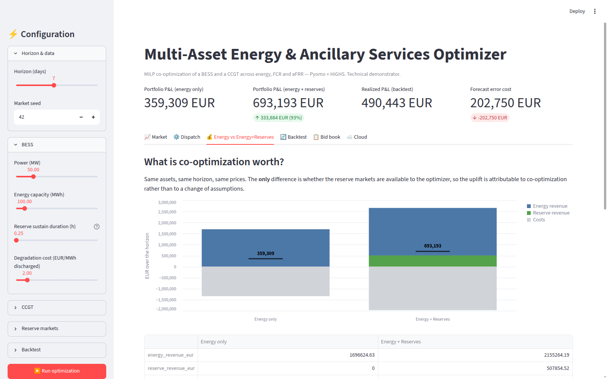
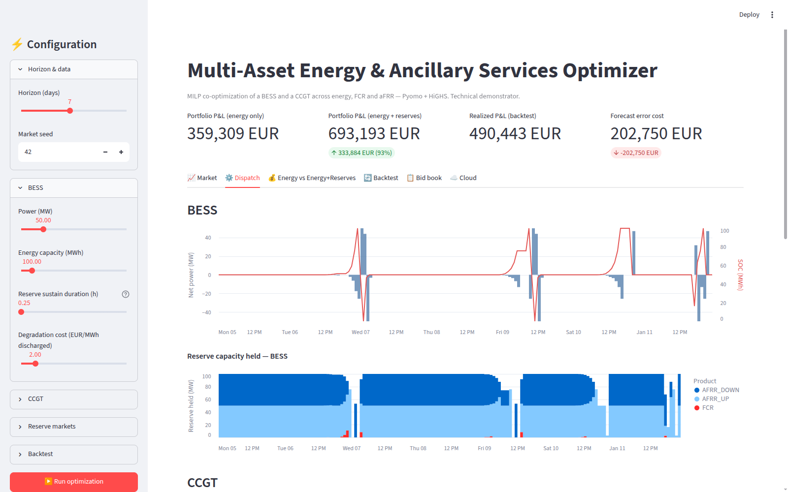
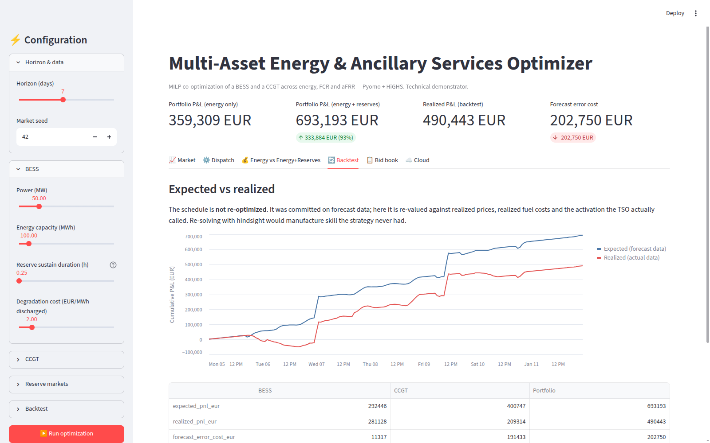

# Multi-Asset Energy & Ancillary Services Optimizer

[](https://github.com/romromromromrom/energy-portfolio-optimizer/actions/workflows/ci-cd.yml)

MILP co-optimization of a **battery (BESS)** and a **CCGT** across the **energy**,
**FCR** and **aFRR** markets — Pyomo + HiGHS, fully open-source, no commercial
solver licence.

> **Technical demonstrator, not a production bidding system.** Market data is
> synthetic. See [Limitations](#limitations) before reading any number as a
> forecast.

---

## What it does

Given a price horizon, it decides — for every hour, for both assets at once —
how much energy to buy or sell and how much capacity to hold back and sell as
reserve, subject to the physics of each asset. It then:

- quantifies what **co-optimizing energy and reserves is worth** versus trading
  energy alone,
- turns the schedule into a **bid table** an operator could submit,
- **backtests** the committed decision against data it never saw,
- serves all of it through a **Streamlit** UI, containerised and deployable to AWS.

## The result worth explaining

On the default 7-day synthetic horizon:

| | Energy only | Energy + Reserves |
|---|---:|---:|
| Portfolio P&L | 359,309 EUR | **693,193 EUR** |
| of which reserve revenue | 0 | 507,855 EUR |
| Uplift | — | **+333,884 EUR (+93%)** |

And underneath that number, the behaviour that only a *co-optimized* model can
find: the CCGT commits for 106 h, and **runs 71 of those hours with the spot
price below its short-run marginal cost** — losing an average of 2,254 EUR/h on
energy — because sitting at Pmin lets it sell the full Pmax−Pmin headroom as
aFRR-up capacity, which more than pays for the loss.

Nothing hard-codes that. It falls out of the objective. An energy-only model, or
two models solved market by market, cannot represent the trade-off at all.





## Markets and assets

| | Products | Remuneration |
|---|---|---|
| **Energy** | day-ahead spot | EUR/MWh delivered |
| **FCR** | symmetric | capacity only (EUR/MW/h) |
| **aFRR** | up, down | capacity (EUR/MW/h) **+** activation (EUR/MWh, uncertain) |

| Asset | Modelled as |
|---|---|
| **BESS** | power/energy limits, split charge & discharge efficiency, SOC dynamics, cycling degradation cost, mode-exclusivity binary |
| **CCGT** | unit commitment (on/start/stop binaries), Pmin/Pmax, heat rate, CO2, VOM, startup cost, ramp limits, min up/down time |

## Mathematical formulation

Both assets are MILPs. The two constraint families that make this a
*co-optimization* rather than two separate problems:

**Power headroom** — a MW sold as reserve is a MW unavailable for arbitrage.

```
BESS :  p_net + Σ reserve_up   ≤  max_discharge
        p_net − Σ reserve_down ≥ −max_charge          where p_net = discharge − charge

CCGT :  p + Σ reserve_up   ≤  Pmax · on
        p − Σ reserve_down ≥  Pmin · on
```

**Energy headroom (BESS)** — a reserved MW must be *sustainable*. The battery
must hold enough charge to deliver upward reserve for `sustain_duration_h`, and
enough empty room to absorb downward reserve, at both the opening and closing
SOC of each period:

```
Σ reserve_up   · sustain ≤ soc − soc_min
Σ reserve_down · sustain ≤ soc_max − soc
```

**Objective** — maximise energy margin − costs + reserve value, where the value
of holding 1 MW for 1 h is:

```
capacity_price  +  ratio × (activation_price − opportunity_cost)      [up]
capacity_price  +  ratio × (opportunity_cost − activation_price)      [down]
capacity_price                                                        [symmetric]
```

**Activation energy is not free revenue.** Being called upward makes the CCGT
burn gas and the battery forgo a spot sale, so activation is valued at its
*margin* over the opportunity cost (SRMC for the CCGT, spot + degradation for
the battery), never at the gross activation price. A symmetric product like FCR
is treated as energy-neutral in expectation — which is also why FCR is
remunerated on capacity alone in France.

That valuation lives in one module (`valuation.py`) used by the MILP objective,
the P&L attribution *and* the backtest, so the optimizer's "expected P&L" and
the backtest's "expected" leg are the same number by construction. A test
asserts it to 1e-9.

## Backtesting

Two phases, kept strictly separate:

1. **Optimize** on forecast prices and assumed activation ratios → a *decision*.
2. **Re-value** that same decision, unchanged, against realized prices, realized
   fuel costs and the activation actually called.

The schedule is never re-solved. Re-optimizing with hindsight is the standard
way a backtest manufactures skill a strategy never had.

```
forecast_error_cost = expected_pnl − realized_pnl
```

On the default horizon this splits revealingly: the BESS loses 11 kEUR to
forecast error, the CCGT 191 kEUR. The battery's revenue is reserve-capacity
dominated and largely insensitive to spot-price error; the CCGT's is
energy-margin dominated and highly sensitive to it. That asymmetry is a portfolio
risk statement, produced by the model rather than asserted.



## Automatic bidding

`bids.py` emits `timestamp | asset | market | direction | volume_mw | price`.
A CCGT bids its **short-run marginal cost** into energy (bidding the spot price
back at the market is meaningless); reserve is bid at the product's capacity
price. Bids under a minimum volume are dropped — MILP solutions carry numerical
residue, and real markets have a minimum increment anyway.

## Architecture

```
src/energy_portfolio/
├── config.py          CCGTConfig, ReserveProductConfig  (capacity vs activation, kept separate)
├── bess_config.py     BESSReserveConfig
├── valuation.py       what 1 MW of reserve is worth — shared by MILP, P&L and backtest
├── bess_reserve.py    MILP: arbitrage + FCR/aFRR with power & energy headroom
├── ccgt.py            MILP: unit commitment + reserve headroom
├── portfolio.py       solve both, attribute P&L, compare energy-only vs co-optimized
├── backtest.py        expected vs realized on a fixed decision
├── bids.py            schedule -> bid table
├── market_data.py     SYNTHETIC data generator (seeded, replaceable)
├── s3_store.py        DataFrame <-> S3
└── solver.py          HiGHS via Pyomo APPSI
app/
├── streamlit_app.py   UI
└── charts.py          Altair builders
```

## How to run locally

```bash
python3.12 -m venv .venv && source .venv/bin/activate
pip install -e ".[dev]"
pytest -q                             # 45 tests
streamlit run app/streamlit_app.py    # http://localhost:8501
```

## Tests

45 tests, all green. The ones that carry weight:

- `test_starts_at_pmin_below_marginal_cost_to_sell_reserve` — pins the headline
  economic behaviour, and asserts the *energy-only* run stays off for the same prices.
- `test_expected_leg_reproduces_the_optimizer_pnl` — optimizer and backtest agree to 1e-9.
- `test_perfect_foresight_leaves_no_forecast_error` — realized == forecast ⟹ zero error cost.
- `test_access_to_reserve_markets_can_never_destroy_value` — adding a market only adds
  options; a violation would mean the formulation is mis-specified.
- `test_reserve_never_exceeds_energy_headroom` / `..._power_headroom` — the coupling constraints hold.
- `test_backtest_does_not_re_optimize_the_schedule` — the committed decision survives untouched.
- `test_streamlit_app_runs_without_exception` — boots the real app under `AppTest` and walks every tab.

```bash
pytest -q                    # everything
pytest -q -m "not slow"      # skip the Streamlit boot test
```

## Docker

```bash
docker compose up -d --build     # http://localhost:8501
```

## Cloud architecture

```
GitHub  ──push main──▶  GitHub Actions  ──pytest──▶  ssh + docker compose  ──▶  EC2 (t3.micro)
                                                                                 │
                                                          instance IAM role ─────┤
                                                                                 ▼
                                                                        S3 (market data, results)
```

Credentials are never read from code or committed. boto3 resolves them from the
environment locally and from an **EC2 instance role** in deployment, so no static
key exists as a file on the server. See `GUIDE-COMPLET-implementation-et-AWS.md`
for the step-by-step AWS setup (budget alert first).

## Limitations

Stated plainly, because knowing where a model stops matters more than the model:

- **Data is synthetic.** Seeded, with a plausible French-market shape (double
  daily peak, midday solar depression, cheaper weekends, scarcity spikes), but
  not sourced from RTE or ENTSO-E. Every headline number inherits that. Swap in
  a real CSV with the same columns and nothing downstream changes.
- **BESS and CCGT are optimized independently**, then aggregated. There is no
  joint portfolio constraint (shared grid connection, aggregated reserve
  obligation, portfolio risk budget). That is the next structural step.
- **Reserve capacity prices enter as a horizon average per product**, not an
  hourly curve. Auctions clear per block, so this is a first approximation.
- **Activation is an assumed expected ratio**, re-evaluated against a drawn
  realized ratio in the backtest. Activation energy does not feed back into SOC
  or fuel burn within the optimization period.
- **One sustain duration per product** stands in for exact per-product/per-TSO
  prequalification rules.
- **No detailed CCGT startup trajectory** — ramp limits are relaxed on
  start/stop periods; the unit reaches Pmin instantly.
- **Bid prices are marginal-cost based.** No opportunity-cost adder from the SOC
  shadow price or a water value.
- **Volume caps are a blunt proxy** for market depth, not a bid-into-a-supply-curve
  formulation.

## Next steps

1. Real RTE / ENTSO-E data in place of the generator.
2. A joint portfolio-level reserve constraint coupling the two assets.
3. Hourly reserve capacity price curves in the MILP (the objective is already
   linear in reserve volume — a small change).
4. SOC shadow price from the MILP duals as an opportunity-cost adder on bids.
5. Hydro / pumped storage / wind as further asset classes.
6. FastAPI service alongside the Streamlit UI.
